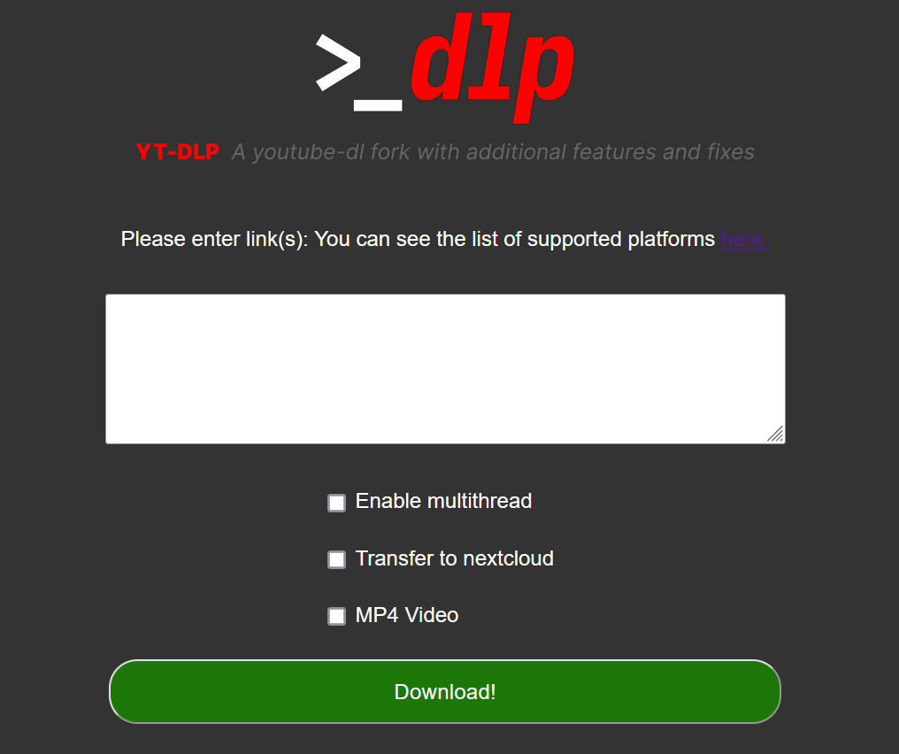

# Web-dlp

<!--- BEGIN SHIELDS.IO --->


<br>

<br>

<!--- END SHIELDS.IO --->




A simple web interface for [yt-dlp](https://github.com/yt-dlp/yt-dlp), with extra compatibility for [Nextcloud](https://nextcloud.com/) file system and [Nextcloud Music](https://apps.nextcloud.com/apps/music) app.

## Features
- All video sources within the official [list](https://github.com/yt-dlp/yt-dlp/blob/master/supportedsites.md) are supported.
- Mass download videos and convert to either mp3 or mp4 format at the best quality possible.
- Select resolution for single videos.
- Transfer music to your local nextcloud instance and update all the required databases automatically.
- ~~Multi-threading support~~ Temporarily not available, currently under development. Previous implementation had issue when processing big files.
- Easy deployment with docker.

## Configuring the docker-compose.yml file

### I. Ports
Set to your preferred port. Default port is **6030**.

### II. Environment variables
Environment variables. They are pretty self-explanatory.

- `TZ` : Sets your timezone, using the corresponding TZ identifier from [this list](https://en.m.wikipedia.org/wiki/List_of_tz_database_time_zones/).
- `OCC_PATH`: Your path to the nextcloud occ script
- `NC_USER` : Your nextcloud user
- `NC_MUSIC_DIRECTORY`: Your nextcloud music directory path, as shown to your nextcloud instance
- `FLASK_SECRET_KEY`: A secret key for flask. Required for various security reasons. You **must** change that
- `REDIS_HOST`: Hostname or IP Address for redis. It's not required to change that for most cases, keep the value of [docker-compose file](docker-compose.yml).
- `REDIS_PASSWORD`: Password for redis database. You **must** change that too.
- `REDIS_PORT`: Port for redis. No need to change that, just like `REDIS_HOST`.

### III. Volumes
This project requires 2 volumes;
- Volume for your nextcloud music folder. This time use the ENTIRE path, not the one shown on your nextcloud instance
```yml
- /path/to/your/nextcloud/music/folder:/ytdlpFolder/Library
```
- Volume for configuration and all necessary files. They're needed for transferring to nextcloud. See the [next](#optional-transferring-to-nextcloud) section for more.
```yml
- /dockerData/ytdlpweb/config:/config
```

## (Optional) Transferring to Nextcloud
This is the kinda tricky part, but rewarding. It may get automatized on future releases. The steps are as such:
1. Go to the config folder and create a [FIFO file](https://man7.org/linux/man-pages/man7/fifo.7.html) aka pipe, named _mypipe_ (use name AS IS). Provide root priviledges if needed. This pipe will be the communication between the container and the host system.

```shell
$ cd /dockerData/ytdlpweb/config
$ mkfifo mypipe
```
2. Create a script that forever reads the pipe and make it executable. For extra security, create it as root.
```sh
$ nano pipescript.sh
#!/bin/sh
while true; do eval "$(cat /dockerData/ytdlpweb/config/mypipe)"; done
$ chmod +x pipescript.sh
```
3. Add the script to root's crontab so it starts on startup
```sh
$ sudo crontab -e
@reboot /dockerData/ytdlpweb/config/pipescript.sh
```
Aaaaand that's it!

## Installation
1. Clone this repository

```sh
$ git clone https://github.com/thetonk/web-dlp.git
```
2. Build docker image. Provide root priviledges if required

```sh
$ docker build -t ytdlpweb .
```
3. Deploy the previously created image using the properly configured _docker-compose.yml_ file

```sh
$ docker compose up -d
```
